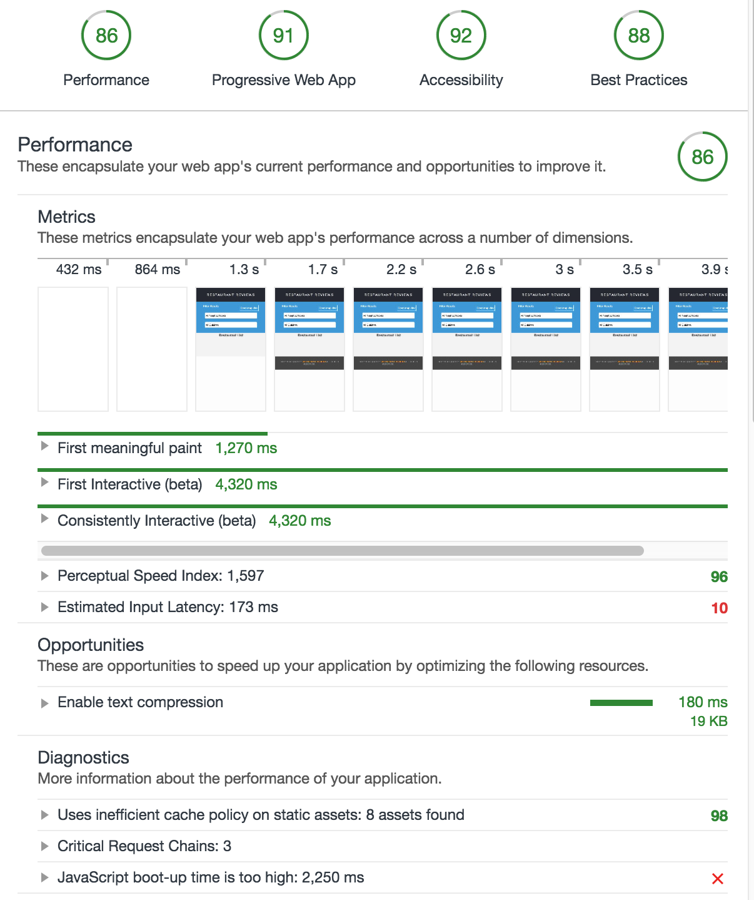

# Mobile Web Specialist Certification Course
---
#### _Three Stage Course Material Project - Restaurant Reviews_

## Project Overview: Stage 2

**Dear Reviewers from Udacity**

Thanks for your time reviewing my works, here is the instruction to help you easily run the project.

### Install

```bash
npm install
```

1. The code is running in **production mode**:

```bash
npm start
```

open another tab:

```bash
npm run serve
```

2. With your server running, visit the site: `http://localhost:8000`, and look around for a bit to see what the current experience looks like.

### Lighthouse scores:



