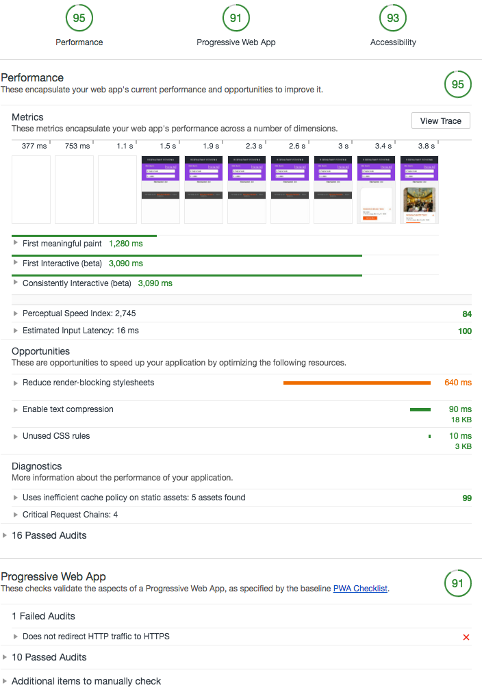

# Mobile Web Specialist Certification Course
---
#### _Three Stage Course Material Project - Restaurant Reviews_

## Project Overview: Stage 3

**Dear Reviewers from Udacity**

Thanks for your time reviewing my works, here is the instruction to help you easily run the project.

**IMPORTANT NOTE:**

When testing offline review post 

**DO NOT USE CHROME DEVTOOLS OFFLINE.**

Instead, please turn off your computers network or turn off your web server.

checkout more about this on [workbox doc](https://developers.google.com/web/tools/workbox/modules/workbox-background-sync)


### Install

```bash
npm install
```

1. The code is running in **production mode**:

```bash
npm start
```

open another tab:

```bash
npm run serve
```

2. With your server running, visit the site: `http://localhost:8000`, and look around for a bit to see what the current experience looks like.


## Feature includes:
    1. Full offline application
    2. Background sycn for retry posting data when user offline
    3. Able to post new review
    4. Lighthouse socre over 90 for Perofrmance, PWA and Accessibility


### offline hint

We users go offline, there are tow hints to show current application is offline.

First, showing in the header


Second, showing in the form


### Lighthouse scores:



